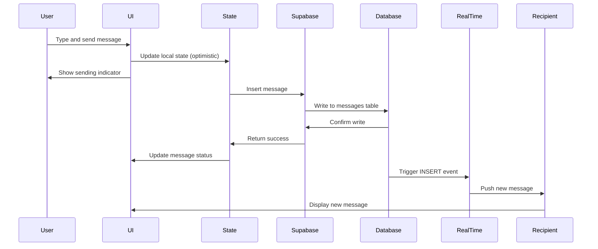
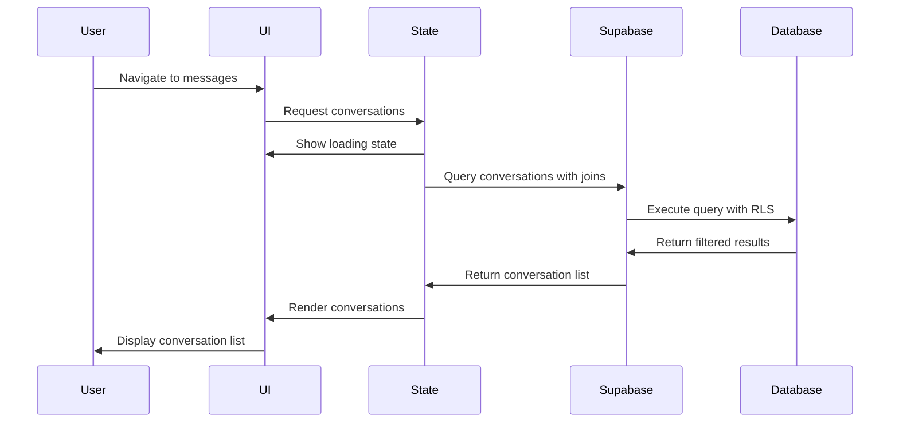

# Design Document: Messaging Module Implementation

## Overview

This design document specifies the technical implementation of a real-time messaging system using Supabase as the backend. The system replaces the existing static messaging UI with a fully functional messaging module that supports:

- Persistent storage of conversations and messages
- Real-time message delivery using Supabase subscriptions
- Row-level security for data privacy
- Message read status tracking
- Unread message indicators
- Authentication integration

The implementation leverages Supabase's PostgreSQL database, real-time capabilities, and authentication system to provide a secure, scalable messaging solution within a Next.js application.

### Key Design Principles

1. **Security First**: Row-level security policies ensure users can only access their own conversations
2. **Real-Time by Default**: Supabase subscriptions provide instant message delivery without polling
3. **Optimistic UI**: Client-side state updates provide immediate feedback while database operations complete
4. **Graceful Degradation**: Error handling and loading states ensure a smooth user experience
5. **Type Safety**: TypeScript interfaces ensure data consistency across the application

## Architecture

### System Components

```mermaid
graph TB
    subgraph "Client Layer"
        UI[Message UI Components]
        State[React State Management]
        Client[Supabase Client]
    end
    
    subgraph "Supabase Backend"
        Auth[Authentication]
        DB[(PostgreSQL Database)]
        RLS[Row Level Security]
        RT[Real-Time Engine]
    end
    
    UI --> State
    State --> Client
    Client --> Auth
    Client --> DB
    DB --> RLS
    DB --> RT
    RT --> Client
    
    style UI fill:#5fa4c3
    style DB fill:#2d3f47
    style RT fill:#5fa4c3
```



### Data Flow

#### Sending a Message



#### Loading Conversations



### Component Architecture

The messaging module consists of three primary UI components:

1. **ConversationList**: Displays all conversations with metadata
   - Shows participant information
   - Displays last message preview
   - Shows unread indicators
   - Handles conversation selection

2. **MessageThread**: Displays messages within a conversation
   - Renders messages chronologically
   - Differentiates sent vs received messages
   - Shows timestamps
   - Handles real-time updates

3. **MessageInput**: Handles message composition
   - Validates input length
   - Manages send button state
   - Provides character count feedback
   - Handles submission

## Components and Interfaces

### Database Schema

#### Conversations Table

```sql
CREATE TABLE conversations (
  id UUID PRIMARY KEY DEFAULT gen_random_uuid(),
  participant_one_id UUID NOT NULL REFERENCES auth.users(id) ON DELETE CASCADE,
  participant_two_id UUID NOT NULL REFERENCES auth.users(id) ON DELETE CASCADE,
  created_at TIMESTAMPTZ NOT NULL DEFAULT NOW(),
  updated_at TIMESTAMPTZ NOT NULL DEFAULT NOW(),
  
  -- Ensure participant_one_id is always the lower UUID for consistency
  CONSTRAINT participant_order CHECK (participant_one_id < participant_two_id),
  
  -- Prevent duplicate conversations
  CONSTRAINT unique_participants UNIQUE (participant_one_id, participant_two_id)
);

-- Indexes for query performance
CREATE INDEX idx_conversations_participant_one ON conversations(participant_one_id);
CREATE INDEX idx_conversations_participant_two ON conversations(participant_two_id);
CREATE INDEX idx_conversations_updated_at ON conversations(updated_at DESC);
```

#### Messages Table

```sql
CREATE TABLE messages (
  id UUID PRIMARY KEY DEFAULT gen_random_uuid(),
  conversation_id UUID NOT NULL REFERENCES conversations(id) ON DELETE CASCADE,
  sender_id UUID NOT NULL REFERENCES auth.users(id) ON DELETE CASCADE,
  content TEXT NOT NULL CHECK (char_length(content) > 0 AND char_length(content) <= 5000),
  created_at TIMESTAMPTZ NOT NULL DEFAULT NOW(),
  read_at TIMESTAMPTZ,
  
  -- Ensure content is not empty
  CONSTRAINT content_not_empty CHECK (trim(content) != '')
);

-- Indexes for query performance
CREATE INDEX idx_messages_conversation ON messages(conversation_id);
CREATE INDEX idx_messages_created_at ON messages(created_at);
CREATE INDEX idx_messages_sender ON messages(sender_id);
CREATE INDEX idx_messages_read_status ON messages(conversation_id, read_at) WHERE read_at IS NULL;
```

#### Row Level Security Policies

```sql
-- Enable RLS
ALTER TABLE conversations ENABLE ROW LEVEL SECURITY;
ALTER TABLE messages ENABLE ROW LEVEL SECURITY;

-- Conversations: Users can read conversations they participate in
CREATE POLICY "Users can view their conversations"
  ON conversations FOR SELECT
  USING (
    auth.uid() = participant_one_id OR 
    auth.uid() = participant_two_id
  );

-- Conversations: Users can create conversations they participate in
CREATE POLICY "Users can create conversations"
  ON conversations FOR INSERT
  WITH CHECK (
    auth.uid() = participant_one_id OR 
    auth.uid() = participant_two_id
  );

-- Messages: Users can read messages from their conversations
CREATE POLICY "Users can view messages in their conversations"
  ON messages FOR SELECT
  USING (
    EXISTS (
      SELECT 1 FROM conversations
      WHERE conversations.id = messages.conversation_id
      AND (
        conversations.participant_one_id = auth.uid() OR
        conversations.participant_two_id = auth.uid()
      )
    )
  );

-- Messages: Users can insert messages into their conversations
CREATE POLICY "Users can send messages in their conversations"
  ON messages FOR INSERT
  WITH CHECK (
    auth.uid() = sender_id AND
    EXISTS (
      SELECT 1 FROM conversations
      WHERE conversations.id = messages.conversation_id
      AND (
        conversations.participant_one_id = auth.uid() OR
        conversations.participant_two_id = auth.uid()
      )
    )
  );

-- Messages: Users can update read_at for messages they received
CREATE POLICY "Users can mark received messages as read"
  ON messages FOR UPDATE
  USING (
    EXISTS (
      SELECT 1 FROM conversations
      WHERE conversations.id = messages.conversation_id
      AND (
        (conversations.participant_one_id = auth.uid() AND messages.sender_id = conversations.participant_two_id) OR
        (conversations.participant_two_id = auth.uid() AND messages.sender_id = conversations.participant_one_id)
      )
    )
  )
  WITH CHECK (
    -- Only allow updating read_at field
    read_at IS NOT NULL
  );
```

#### Database Triggers

```sql
-- Update conversation updated_at when a message is inserted
CREATE OR REPLACE FUNCTION update_conversation_timestamp()
RETURNS TRIGGER AS $$
BEGIN
  UPDATE conversations
  SET updated_at = NEW.created_at
  WHERE id = NEW.conversation_id;
  RETURN NEW;
END;
$$ LANGUAGE plpgsql;

CREATE TRIGGER update_conversation_on_message
  AFTER INSERT ON messages
  FOR EACH ROW
  EXECUTE FUNCTION update_conversation_timestamp();
```

### TypeScript Interfaces

```typescript
// Database types
interface Database {
  public: {
    Tables: {
      conversations: {
        Row: {
          id: string;
          participant_one_id: string;
          participant_two_id: string;
          created_at: string;
          updated_at: string;
        };
        Insert: {
          id?: string;
          participant_one_id: string;
          participant_two_id: string;
          created_at?: string;
          updated_at?: string;
        };
        Update: {
          id?: string;
          participant_one_id?: string;
          participant_two_id?: string;
          created_at?: string;
          updated_at?: string;
        };
      };
      messages: {
        Row: {
          id: string;
          conversation_id: string;
          sender_id: string;
          content: string;
          created_at: string;
          read_at: string | null;
        };
        Insert: {
          id?: string;
          conversation_id: string;
          sender_id: string;
          content: string;
          created_at?: string;
          read_at?: string | null;
        };
        Update: {
          id?: string;
          conversation_id?: string;
          sender_id?: string;
          content?: string;
          created_at?: string;
          read_at?: string | null;
        };
      };
    };
  };
}

// Application types
interface ConversationWithDetails {
  id: string;
  participant_one_id: string;
  participant_two_id: string;
  created_at: string;
  updated_at: string;
  other_participant: {
    id: string;
    email: string;
    user_metadata: {
      full_name?: string;
      username?: string;
    };
  };
  last_message: {
    content: string;
    created_at: string;
  } | null;
  unread_count: number;
}

interface MessageWithSender {
  id: string;
  conversation_id: string;
  sender_id: string;
  content: string;
  created_at: string;
  read_at: string | null;
  sender: {
    id: string;
    email: string;
    user_metadata: {
      full_name?: string;
      username?: string;
    };
  };
}

interface MessageInput {
  content: string;
  conversation_id: string;
}

interface ConversationInput {
  other_user_id: string;
}
```

### API Functions

#### Conversation Management

```typescript
// Get or create a conversation between two users
async function getOrCreateConversation(
  currentUserId: string,
  otherUserId: string
): Promise<{ data: string | null; error: Error | null }> {
  // Ensure participant_one_id is always the lower UUID
  const [participantOne, participantTwo] = 
    currentUserId < otherUserId 
      ? [currentUserId, otherUserId]
      : [otherUserId, currentUserId];

  // Check if conversation exists
  const { data: existing, error: fetchError } = await supabase
    .from('conversations')
    .select('id')
    .eq('participant_one_id', participantOne)
    .eq('participant_two_id', participantTwo)
    .single();

  if (existing) {
    return { data: existing.id, error: null };
  }

  // Create new conversation
  const { data: newConv, error: createError } = await supabase
    .from('conversations')
    .insert({
      participant_one_id: participantOne,
      participant_two_id: participantTwo,
    })
    .select('id')
    .single();

  if (createError) {
    return { data: null, error: createError };
  }

  return { data: newConv.id, error: null };
}

// Get all conversations for the current user
async function getConversations(
  currentUserId: string
): Promise<{ data: ConversationWithDetails[] | null; error: Error | null }> {
  const { data, error } = await supabase
    .from('conversations')
    .select(`
      id,
      participant_one_id,
      participant_two_id,
      created_at,
      updated_at
    `)
    .or(`participant_one_id.eq.${currentUserId},participant_two_id.eq.${currentUserId}`)
    .order('updated_at', { ascending: false });

  if (error) {
    return { data: null, error };
  }

  // Fetch additional details for each conversation
  const conversationsWithDetails = await Promise.all(
    data.map(async (conv) => {
      const otherUserId = 
        conv.participant_one_id === currentUserId
          ? conv.participant_two_id
          : conv.participant_one_id;

      // Get other participant details
      const { data: userData } = await supabase.auth.admin.getUserById(otherUserId);

      // Get last message
      const { data: lastMessage } = await supabase
        .from('messages')
        .select('content, created_at')
        .eq('conversation_id', conv.id)
        .order('created_at', { ascending: false })
        .limit(1)
        .single();

      // Get unread count
      const { count: unreadCount } = await supabase
        .from('messages')
        .select('*', { count: 'exact', head: true })
        .eq('conversation_id', conv.id)
        .neq('sender_id', currentUserId)
        .is('read_at', null);

      return {
        ...conv,
        other_participant: userData?.user || null,
        last_message: lastMessage,
        unread_count: unreadCount || 0,
      };
    })
  );

  return { data: conversationsWithDetails, error: null };
}
```

#### Message Management

```typescript
// Send a message
async function sendMessage(
  conversationId: string,
  senderId: string,
  content: string
): Promise<{ data: MessageWithSender | null; error: Error | null }> {
  // Validate content
  const trimmedContent = content.trim();
  if (!trimmedContent || trimmedContent.length > 5000) {
    return { 
      data: null, 
      error: new Error('Message must be between 1 and 5000 characters') 
    };
  }

  const { data, error } = await supabase
    .from('messages')
    .insert({
      conversation_id: conversationId,
      sender_id: senderId,
      content: trimmedContent,
    })
    .select(`
      id,
      conversation_id,
      sender_id,
      content,
      created_at,
      read_at
    `)
    .single();

  if (error) {
    return { data: null, error };
  }

  return { data: data as MessageWithSender, error: null };
}

// Get messages for a conversation
async function getMessages(
  conversationId: string
): Promise<{ data: MessageWithSender[] | null; error: Error | null }> {
  const { data, error } = await supabase
    .from('messages')
    .select(`
      id,
      conversation_id,
      sender_id,
      content,
      created_at,
      read_at
    `)
    .eq('conversation_id', conversationId)
    .order('created_at', { ascending: true });

  if (error) {
    return { data: null, error };
  }

  return { data: data as MessageWithSender[], error: null };
}

// Mark messages as read
async function markMessagesAsRead(
  conversationId: string,
  currentUserId: string
): Promise<{ error: Error | null }> {
  const { error } = await supabase
    .from('messages')
    .update({ read_at: new Date().toISOString() })
    .eq('conversation_id', conversationId)
    .neq('sender_id', currentUserId)
    .is('read_at', null);

  return { error };
}
```

#### Real-Time Subscriptions

```typescript
// Subscribe to new messages in a conversation
function subscribeToMessages(
  conversationId: string,
  onMessage: (message: MessageWithSender) => void
): RealtimeChannel {
  const channel = supabase
    .channel(`messages:${conversationId}`)
    .on(
      'postgres_changes',
      {
        event: 'INSERT',
        schema: 'public',
        table: 'messages',
        filter: `conversation_id=eq.${conversationId}`,
      },
      async (payload) => {
        // Fetch sender details
        const { data: userData } = await supabase.auth.admin.getUserById(
          payload.new.sender_id
        );

        const messageWithSender: MessageWithSender = {
          ...payload.new,
          sender: userData?.user || null,
        };

        onMessage(messageWithSender);
      }
    )
    .subscribe();

  return channel;
}

// Unsubscribe from a channel
function unsubscribeFromMessages(channel: RealtimeChannel): void {
  supabase.removeChannel(channel);
}

// Subscribe to conversation updates (for unread counts)
function subscribeToConversationUpdates(
  userId: string,
  onUpdate: () => void
): RealtimeChannel {
  const channel = supabase
    .channel(`conversations:${userId}`)
    .on(
      'postgres_changes',
      {
        event: '*',
        schema: 'public',
        table: 'messages',
      },
      (payload) => {
        // Trigger conversation list refresh
        onUpdate();
      }
    )
    .subscribe();

  return channel;
}
```

## Data Models

### State Management

The messaging module uses React hooks for state management:

```typescript
// Conversation list state
interface ConversationListState {
  conversations: ConversationWithDetails[];
  loading: boolean;
  error: string | null;
  selectedConversationId: string | null;
}

// Message thread state
interface MessageThreadState {
  messages: MessageWithSender[];
  loading: boolean;
  error: string | null;
  sending: boolean;
}

// Message input state
interface MessageInputState {
  content: string;
  charCount: number;
  isValid: boolean;
  isSending: boolean;
}
```

### Data Validation

```typescript
// Message content validation
function validateMessageContent(content: string): {
  isValid: boolean;
  error: string | null;
} {
  const trimmed = content.trim();
  
  if (trimmed.length === 0) {
    return { isValid: false, error: 'Message cannot be empty' };
  }
  
  if (trimmed.length > 5000) {
    return { 
      isValid: false, 
      error: `Message too long (${trimmed.length}/5000 characters)` 
    };
  }
  
  return { isValid: true, error: null };
}

// User ID validation
function validateUserId(userId: string): boolean {
  // UUID v4 format validation
  const uuidRegex = /^[0-9a-f]{8}-[0-9a-f]{4}-4[0-9a-f]{3}-[89ab][0-9a-f]{3}-[0-9a-f]{12}$/i;
  return uuidRegex.test(userId);
}
```

### Data Transformation

```typescript
// Format timestamp for display
function formatTimestamp(timestamp: string): string {
  const date = new Date(timestamp);
  const now = new Date();
  const diffMs = now.getTime() - date.getTime();
  const diffMins = Math.floor(diffMs / 60000);
  const diffHours = Math.floor(diffMs / 3600000);
  const diffDays = Math.floor(diffMs / 86400000);

  if (diffMins < 1) return 'Just now';
  if (diffMins < 60) return `${diffMins} min ago`;
  if (diffHours < 24) return `${diffHours} hour${diffHours > 1 ? 's' : ''} ago`;
  if (diffDays < 7) return `${diffDays} day${diffDays > 1 ? 's' : ''} ago`;
  
  return date.toLocaleDateString();
}

// Get display name for user
function getDisplayName(user: {
  email: string;
  user_metadata: { full_name?: string; username?: string };
}): string {
  return user.user_metadata?.full_name || 
         user.user_metadata?.username || 
         user.email.split('@')[0];
}
```


## Correctness Properties

*A property is a characteristic or behavior that should hold true across all valid executions of a system—essentially, a formal statement about what the system should do. Properties serve as the bridge between human-readable specifications and machine-verifiable correctness guarantees.*

### Database Integrity Properties

#### Property 1: Foreign Key Enforcement for Participants

*For any* attempt to create a conversation with invalid user IDs (participant_one_id or participant_two_id not in the users table), the database SHALL reject the insertion with a foreign key constraint error.

**Validates: Requirements 1.2, 1.3**

#### Property 2: Foreign Key Enforcement for Messages

*For any* attempt to create a message with an invalid sender_id (not in the users table) or invalid conversation_id (not in the conversations table), the database SHALL reject the insertion with a foreign key constraint error.

**Validates: Requirements 2.3**

#### Property 3: Conversation Uniqueness

*For any* two users, attempting to create multiple conversations between them (regardless of participant order) SHALL result in only one conversation existing, with subsequent attempts either returning the existing conversation or failing with a unique constraint violation.

**Validates: Requirements 1.4**

#### Property 4: Cascade Delete Behavior

*For any* conversation that is deleted, all messages associated with that conversation SHALL also be deleted automatically.

**Validates: Requirements 2.2**

#### Property 5: Message Content Validation

*For any* message with empty content (null or whitespace-only) or content exceeding 5000 characters, the system SHALL reject the message and return a validation error.

**Validates: Requirements 2.6, 6.1, 6.2**

#### Property 6: Participant Ordering Invariant

*For any* conversation in the database, participant_one_id SHALL always be less than participant_two_id (maintaining consistent ordering).

**Validates: Requirements 5.4**

### Security Properties

#### Property 7: Conversation Read Authorization

*For any* user and conversation, the user SHALL be able to read the conversation if and only if they are either participant_one_id or participant_two_id.

**Validates: Requirements 3.3**

#### Property 8: Conversation Creation Authorization

*For any* user attempting to create a conversation, the operation SHALL succeed if and only if the user is one of the two participants.

**Validates: Requirements 3.4**

#### Property 9: Message Read Authorization

*For any* user and message, the user SHALL be able to read the message if and only if they are a participant in the message's conversation.

**Validates: Requirements 3.5**

#### Property 10: Message Send Authorization

*For any* user attempting to send a message, the operation SHALL succeed if and only if the user is a participant in the target conversation and the user's ID matches the sender_id.

**Validates: Requirements 3.6**

#### Property 11: Read Status Update Authorization

*For any* user attempting to update a message's read_at field, the operation SHALL succeed if and only if the user is the recipient (not the sender) of that message.

**Validates: Requirements 3.7, 9.3**

### Data Retrieval Properties

#### Property 12: Conversation List Completeness

*For any* authenticated user, querying their conversations SHALL return exactly the set of conversations where they are either participant_one_id or participant_two_id, with no duplicates or omissions.

**Validates: Requirements 4.1**

#### Property 13: Conversation Data Completeness

*For any* conversation returned to a user, the response SHALL include the other participant's profile information, the most recent message (if any), and the unread message count.

**Validates: Requirements 4.2, 4.3, 4.4**

#### Property 14: Conversation Ordering

*For any* list of conversations returned, they SHALL be ordered by the updated_at timestamp in descending order (most recent first).

**Validates: Requirements 4.5**

#### Property 15: Message List Completeness

*For any* conversation, querying its messages SHALL return all messages in that conversation with sender information included.

**Validates: Requirements 7.1, 7.3**

#### Property 16: Message Ordering

*For any* list of messages returned for a conversation, they SHALL be ordered by created_at timestamp in ascending order (chronological).

**Validates: Requirements 7.2**

#### Property 17: Unread Count Accuracy

*For any* conversation and user, the unread_count SHALL equal the number of messages in that conversation where read_at is null and the sender_id is not the current user's ID.

**Validates: Requirements 10.2**

### Conversation Management Properties

#### Property 18: Get-or-Create Idempotence

*For any* two users, calling the get-or-create conversation function multiple times SHALL always return the same conversation ID, creating a new conversation only on the first call.

**Validates: Requirements 5.1, 5.2, 5.3**

#### Property 19: Conversation Creation Returns Valid ID

*For any* successful conversation creation, the operation SHALL return a valid UUID that can be used to query the conversation.

**Validates: Requirements 5.5**

### Message Operations Properties

#### Property 20: Message Persistence

*For any* valid message submitted by an authorized user, the message SHALL be inserted into the database with a created_at timestamp and SHALL be retrievable in subsequent queries.

**Validates: Requirements 6.3**

#### Property 21: Conversation Timestamp Update

*For any* message inserted into a conversation, the conversation's updated_at timestamp SHALL be updated to match the message's created_at timestamp.

**Validates: Requirements 6.4**

#### Property 22: Message Input Normalization

*For any* message content with leading or trailing whitespace, the system SHALL trim the whitespace before validation and storage.

**Validates: Requirements 12.4**

### Real-Time Properties

#### Property 23: Real-Time Message Delivery

*For any* new message inserted into a conversation, all clients subscribed to that conversation's real-time channel SHALL receive the message within a reasonable time frame (< 1 second under normal conditions).

**Validates: Requirements 8.2**

#### Property 24: Real-Time UI Update

*For any* message received via real-time subscription, the message SHALL be appended to the message list in the UI without requiring a page refresh.

**Validates: Requirements 8.3**

#### Property 25: Real-Time Error Resilience

*For any* real-time connection error, the application SHALL handle the error gracefully without crashing and SHALL continue to function (potentially with degraded real-time capabilities).

**Validates: Requirements 8.5**

### Read Status Properties

#### Property 26: Mark as Read on Open

*For any* conversation opened by a user, all unread messages in that conversation (where the user is the recipient) SHALL have their read_at field updated to the current timestamp.

**Validates: Requirements 9.1**

#### Property 27: Read Status Invariant

*For any* message marked as read, the read_at field SHALL be non-null and SHALL represent a timestamp equal to or after the message's created_at timestamp.

**Validates: Requirements 9.2**

#### Property 28: Unread Count Consistency

*For any* conversation, after marking messages as read, the unread_count SHALL decrease by the number of messages that were marked as read.

**Validates: Requirements 9.4**

### UI State Properties

#### Property 29: Message Alignment

*For any* message displayed in the UI, messages where sender_id equals the current user's ID SHALL be aligned right, and messages where sender_id differs SHALL be aligned left.

**Validates: Requirements 7.4, 7.5**

#### Property 30: Timestamp Formatting

*For any* timestamp displayed in the UI, it SHALL be formatted in a human-readable relative format (e.g., "2 min ago", "3 hours ago").

**Validates: Requirements 7.6**

#### Property 31: Unread Indicator Display

*For any* conversation in the conversation list, a visual unread indicator SHALL be displayed if and only if the unread_count is greater than zero.

**Validates: Requirements 10.1, 10.3**

#### Property 32: Real-Time Unread Indicator Update

*For any* new message received via real-time subscription, the unread indicator for the corresponding conversation SHALL update immediately without page refresh.

**Validates: Requirements 10.4**

#### Property 33: Send Button State - Empty Input

*For any* message input state where the trimmed content is empty, the send button SHALL be disabled.

**Validates: Requirements 12.1**

#### Property 34: Send Button State - Length Exceeded

*For any* message input state where the content exceeds 5000 characters, the send button SHALL be disabled.

**Validates: Requirements 12.2**

#### Property 35: Character Count Warning

*For any* message input state where the content exceeds 5000 characters, a character count warning SHALL be displayed.

**Validates: Requirements 12.3**

#### Property 36: Input Clear on Send

*For any* successful message send operation, the message input field SHALL be cleared.

**Validates: Requirements 6.5**

#### Property 37: Loading State Display

*For any* asynchronous operation (loading conversations, loading messages, sending message), a loading indicator SHALL be displayed while the operation is in progress and SHALL be removed when the operation completes or fails.

**Validates: Requirements 14.1, 14.2, 14.3, 14.4**

### Authentication Properties

#### Property 38: Authentication Guard

*For any* unauthenticated user attempting to access the messaging system, the system SHALL redirect them to the login page.

**Validates: Requirements 11.2**

#### Property 39: Authenticated User ID Consistency

*For any* messaging operation (creating conversations, sending messages, querying data), the user ID SHALL be retrieved from the Supabase authentication session and SHALL be consistent across all operations in the same session.

**Validates: Requirements 11.3**

#### Property 40: Token Expiration Handling

*For any* authentication token expiration during messaging operations, the system SHALL handle the expiration gracefully without crashing and SHALL prompt for re-authentication.

**Validates: Requirements 11.5**

### Error Handling Properties

#### Property 41: Error Logging

*For any* error that occurs in the messaging system (database errors, network errors, validation errors), the error SHALL be logged to the console with sufficient detail for debugging.

**Validates: Requirements 13.5**


## Error Handling

### Error Categories

The messaging system handles four primary categories of errors:

1. **Database Errors**: Failed queries, constraint violations, connection issues
2. **Authentication Errors**: Invalid sessions, expired tokens, unauthorized access
3. **Validation Errors**: Invalid input, constraint violations
4. **Network Errors**: Real-time connection failures, API timeouts

### Error Handling Strategy

#### Database Errors

```typescript
async function handleDatabaseOperation<T>(
  operation: () => Promise<{ data: T | null; error: Error | null }>
): Promise<{ data: T | null; error: string | null }> {
  try {
    const { data, error } = await operation();
    
    if (error) {
      console.error('Database error:', error);
      
      // Map database errors to user-friendly messages
      if (error.code === '23505') {
        return { data: null, error: 'This conversation already exists' };
      }
      if (error.code === '23503') {
        return { data: null, error: 'Invalid user or conversation reference' };
      }
      if (error.code === '23514') {
        return { data: null, error: 'Message content is invalid' };
      }
      
      return { data: null, error: 'An error occurred. Please try again.' };
    }
    
    return { data, error: null };
  } catch (err) {
    console.error('Unexpected error:', err);
    return { data: null, error: 'An unexpected error occurred' };
  }
}
```

#### Authentication Errors

```typescript
async function withAuth<T>(
  operation: (userId: string) => Promise<T>
): Promise<{ data: T | null; error: string | null }> {
  try {
    const { data: { user }, error } = await supabase.auth.getUser();
    
    if (error || !user) {
      console.error('Authentication error:', error);
      // Redirect to login
      window.location.href = '/auth/login';
      return { data: null, error: 'Authentication required' };
    }
    
    const result = await operation(user.id);
    return { data: result, error: null };
  } catch (err) {
    console.error('Auth operation error:', err);
    return { data: null, error: 'Authentication failed' };
  }
}
```

#### Validation Errors

```typescript
interface ValidationResult {
  isValid: boolean;
  errors: string[];
}

function validateMessage(content: string): ValidationResult {
  const errors: string[] = [];
  const trimmed = content.trim();
  
  if (trimmed.length === 0) {
    errors.push('Message cannot be empty');
  }
  
  if (trimmed.length > 5000) {
    errors.push(`Message is too long (${trimmed.length}/5000 characters)`);
  }
  
  return {
    isValid: errors.length === 0,
    errors,
  };
}

// Usage in component
const handleSend = () => {
  const validation = validateMessage(messageContent);
  
  if (!validation.isValid) {
    setError(validation.errors[0]);
    return;
  }
  
  // Proceed with sending
};
```

#### Real-Time Connection Errors

```typescript
function setupRealtimeWithRetry(
  conversationId: string,
  onMessage: (message: MessageWithSender) => void,
  maxRetries: number = 3
): RealtimeChannel {
  let retryCount = 0;
  
  const channel = supabase
    .channel(`messages:${conversationId}`)
    .on(
      'postgres_changes',
      {
        event: 'INSERT',
        schema: 'public',
        table: 'messages',
        filter: `conversation_id=eq.${conversationId}`,
      },
      async (payload) => {
        try {
          const messageWithSender = await enrichMessageWithSender(payload.new);
          onMessage(messageWithSender);
        } catch (err) {
          console.error('Error processing real-time message:', err);
        }
      }
    )
    .subscribe((status, err) => {
      if (status === 'CHANNEL_ERROR') {
        console.error('Real-time channel error:', err);
        
        if (retryCount < maxRetries) {
          retryCount++;
          console.log(`Retrying connection (${retryCount}/${maxRetries})...`);
          
          setTimeout(() => {
            channel.subscribe();
          }, 1000 * retryCount); // Exponential backoff
        } else {
          console.error('Max retries reached. Real-time updates disabled.');
          // Show user notification
          showNotification('Real-time updates temporarily unavailable');
        }
      }
      
      if (status === 'SUBSCRIBED') {
        retryCount = 0; // Reset on successful connection
      }
    });
  
  return channel;
}
```

### Error UI Components

#### Error Message Display

```typescript
interface ErrorDisplayProps {
  error: string | null;
  onRetry?: () => void;
  onDismiss?: () => void;
}

function ErrorDisplay({ error, onRetry, onDismiss }: ErrorDisplayProps) {
  if (!error) return null;
  
  return (
    <div className="bg-red-900/20 border border-red-500 rounded-lg p-4 mb-4">
      <div className="flex items-start gap-3">
        <svg className="w-5 h-5 text-red-500 flex-shrink-0 mt-0.5" /* error icon */ />
        <div className="flex-1">
          <p className="text-red-200 text-sm">{error}</p>
          <div className="flex gap-2 mt-2">
            {onRetry && (
              <button
                onClick={onRetry}
                className="text-xs text-red-300 hover:text-red-100 underline"
              >
                Try Again
              </button>
            )}
            {onDismiss && (
              <button
                onClick={onDismiss}
                className="text-xs text-red-300 hover:text-red-100 underline"
              >
                Dismiss
              </button>
            )}
          </div>
        </div>
      </div>
    </div>
  );
}
```

### Error Recovery Strategies

1. **Automatic Retry**: For transient network errors, automatically retry with exponential backoff
2. **User-Initiated Retry**: For failed operations, provide a "Try Again" button
3. **Graceful Degradation**: If real-time fails, fall back to polling or manual refresh
4. **State Preservation**: Preserve user input when errors occur (don't clear the message input on send failure)
5. **Clear Feedback**: Always inform users what went wrong and what they can do about it

## Testing Strategy

### Overview

The messaging module requires comprehensive testing across multiple layers:

1. **Database Layer**: Schema, constraints, RLS policies, triggers
2. **API Layer**: Data retrieval, mutations, real-time subscriptions
3. **Business Logic**: Validation, authorization, data transformation
4. **UI Layer**: Component rendering, user interactions, state management

We employ a dual testing approach combining unit tests for specific scenarios and property-based tests for comprehensive coverage.

### Testing Approach

#### Unit Tests vs Property Tests

**Unit Tests** are used for:
- Specific examples that demonstrate correct behavior
- Edge cases (empty conversations, empty messages)
- Error conditions (network failures, validation errors)
- Integration points (authentication, database connections)
- UI component rendering

**Property-Based Tests** are used for:
- Universal properties that hold for all inputs
- Security properties (authorization checks)
- Data integrity properties (constraints, invariants)
- Comprehensive input coverage through randomization

Both approaches are complementary and necessary for comprehensive coverage. Unit tests catch concrete bugs in specific scenarios, while property tests verify general correctness across a wide range of inputs.

### Property-Based Testing Configuration

We will use **fast-check** for property-based testing in TypeScript/JavaScript:

```bash
npm install --save-dev fast-check @types/fast-check
```

**Configuration Requirements**:
- Minimum 100 iterations per property test (due to randomization)
- Each property test must reference its design document property
- Tag format: `Feature: messaging-module-implementation, Property {number}: {property_text}`

### Test Organization

```
tests/
├── unit/
│   ├── database/
│   │   ├── schema.test.ts
│   │   ├── rls-policies.test.ts
│   │   └── triggers.test.ts
│   ├── api/
│   │   ├── conversations.test.ts
│   │   ├── messages.test.ts
│   │   └── realtime.test.ts
│   ├── validation/
│   │   ├── message-validation.test.ts
│   │   └── user-validation.test.ts
│   └── components/
│       ├── ConversationList.test.tsx
│       ├── MessageThread.test.tsx
│       └── MessageInput.test.tsx
└── property/
    ├── database-integrity.property.test.ts
    ├── security.property.test.ts
    ├── data-retrieval.property.test.ts
    ├── message-operations.property.test.ts
    ├── realtime.property.test.ts
    └── ui-state.property.test.ts
```

### Property Test Examples

#### Property 3: Conversation Uniqueness

```typescript
import fc from 'fast-check';
import { describe, it, expect } from 'vitest';

describe('Feature: messaging-module-implementation, Property 3: Conversation Uniqueness', () => {
  it('should prevent duplicate conversations between the same two users', async () => {
    await fc.assert(
      fc.asyncProperty(
        fc.uuid(), // user1
        fc.uuid(), // user2
        async (user1Id, user2Id) => {
          // Skip if same user
          fc.pre(user1Id !== user2Id);
          
          // Create first conversation
          const conv1 = await getOrCreateConversation(user1Id, user2Id);
          
          // Attempt to create second conversation (same order)
          const conv2 = await getOrCreateConversation(user1Id, user2Id);
          
          // Attempt to create third conversation (reverse order)
          const conv3 = await getOrCreateConversation(user2Id, user1Id);
          
          // All should return the same conversation ID
          expect(conv1.data).toBe(conv2.data);
          expect(conv1.data).toBe(conv3.data);
        }
      ),
      { numRuns: 100 }
    );
  });
});
```

#### Property 5: Message Content Validation

```typescript
describe('Feature: messaging-module-implementation, Property 5: Message Content Validation', () => {
  it('should reject empty or oversized messages', async () => {
    await fc.assert(
      fc.asyncProperty(
        fc.uuid(), // conversationId
        fc.uuid(), // senderId
        fc.oneof(
          fc.constant(''),
          fc.constant('   '),
          fc.string({ minLength: 5001, maxLength: 6000 })
        ),
        async (conversationId, senderId, invalidContent) => {
          const result = await sendMessage(conversationId, senderId, invalidContent);
          
          // Should fail with error
          expect(result.data).toBeNull();
          expect(result.error).not.toBeNull();
        }
      ),
      { numRuns: 100 }
    );
  });
  
  it('should accept valid messages', async () => {
    await fc.assert(
      fc.asyncProperty(
        fc.uuid(), // conversationId
        fc.uuid(), // senderId
        fc.string({ minLength: 1, maxLength: 5000 }).filter(s => s.trim().length > 0),
        async (conversationId, senderId, validContent) => {
          const result = await sendMessage(conversationId, senderId, validContent);
          
          // Should succeed
          expect(result.error).toBeNull();
          expect(result.data).not.toBeNull();
          expect(result.data?.content).toBe(validContent.trim());
        }
      ),
      { numRuns: 100 }
    );
  });
});
```

#### Property 7: Conversation Read Authorization

```typescript
describe('Feature: messaging-module-implementation, Property 7: Conversation Read Authorization', () => {
  it('should allow participants to read their conversations', async () => {
    await fc.assert(
      fc.asyncProperty(
        fc.uuid(), // participant1
        fc.uuid(), // participant2
        async (participant1, participant2) => {
          fc.pre(participant1 !== participant2);
          
          // Create conversation
          const { data: convId } = await getOrCreateConversation(participant1, participant2);
          
          // Both participants should be able to read
          const result1 = await getConversationAsUser(convId, participant1);
          const result2 = await getConversationAsUser(convId, participant2);
          
          expect(result1.data).not.toBeNull();
          expect(result2.data).not.toBeNull();
        }
      ),
      { numRuns: 100 }
    );
  });
  
  it('should prevent non-participants from reading conversations', async () => {
    await fc.assert(
      fc.asyncProperty(
        fc.uuid(), // participant1
        fc.uuid(), // participant2
        fc.uuid(), // outsider
        async (participant1, participant2, outsider) => {
          fc.pre(participant1 !== participant2);
          fc.pre(outsider !== participant1 && outsider !== participant2);
          
          // Create conversation
          const { data: convId } = await getOrCreateConversation(participant1, participant2);
          
          // Outsider should not be able to read
          const result = await getConversationAsUser(convId, outsider);
          
          expect(result.data).toBeNull();
          expect(result.error).not.toBeNull();
        }
      ),
      { numRuns: 100 }
    );
  });
});
```

#### Property 17: Unread Count Accuracy

```typescript
describe('Feature: messaging-module-implementation, Property 17: Unread Count Accuracy', () => {
  it('should accurately count unread messages', async () => {
    await fc.assert(
      fc.asyncProperty(
        fc.uuid(), // user1
        fc.uuid(), // user2
        fc.array(fc.string({ minLength: 1, maxLength: 100 }), { minLength: 1, maxLength: 20 }),
        async (user1, user2, messageContents) => {
          fc.pre(user1 !== user2);
          
          // Create conversation
          const { data: convId } = await getOrCreateConversation(user1, user2);
          
          // User1 sends all messages
          for (const content of messageContents) {
            await sendMessage(convId, user1, content);
          }
          
          // Get conversation as user2
          const { data: conversations } = await getConversations(user2);
          const conv = conversations?.find(c => c.id === convId);
          
          // Unread count should equal number of messages sent
          expect(conv?.unread_count).toBe(messageContents.length);
          
          // Mark as read
          await markMessagesAsRead(convId, user2);
          
          // Get conversation again
          const { data: updatedConversations } = await getConversations(user2);
          const updatedConv = updatedConversations?.find(c => c.id === convId);
          
          // Unread count should now be 0
          expect(updatedConv?.unread_count).toBe(0);
        }
      ),
      { numRuns: 100 }
    );
  });
});
```

### Unit Test Examples

#### Edge Case: Empty Conversation List

```typescript
describe('Empty States', () => {
  it('should display empty state when user has no conversations', async () => {
    const { getByText } = render(<ConversationList userId="new-user-id" />);
    
    await waitFor(() => {
      expect(getByText(/no conversations/i)).toBeInTheDocument();
    });
  });
  
  it('should display empty state when conversation has no messages', async () => {
    const { getByText } = render(
      <MessageThread conversationId="empty-conv-id" currentUserId="user-id" />
    );
    
    await waitFor(() => {
      expect(getByText(/no messages/i)).toBeInTheDocument();
    });
  });
});
```

#### Error Handling: Failed Message Send

```typescript
describe('Error Handling', () => {
  it('should display error and allow retry when message send fails', async () => {
    // Mock sendMessage to fail
    vi.mocked(sendMessage).mockResolvedValueOnce({
      data: null,
      error: new Error('Network error'),
    });
    
    const { getByRole, getByText } = render(
      <MessageInput conversationId="conv-id" currentUserId="user-id" />
    );
    
    const input = getByRole('textbox');
    const sendButton = getByRole('button', { name: /send/i });
    
    // Type and send message
    await userEvent.type(input, 'Test message');
    await userEvent.click(sendButton);
    
    // Should show error
    await waitFor(() => {
      expect(getByText(/error/i)).toBeInTheDocument();
      expect(getByText(/try again/i)).toBeInTheDocument();
    });
    
    // Message should still be in input (not cleared)
    expect(input).toHaveValue('Test message');
  });
});
```

#### Real-Time Subscription Lifecycle

```typescript
describe('Real-Time Subscriptions', () => {
  it('should subscribe when viewing conversation', async () => {
    const subscribeSpy = vi.spyOn(supabase, 'channel');
    
    render(<MessageThread conversationId="conv-id" currentUserId="user-id" />);
    
    await waitFor(() => {
      expect(subscribeSpy).toHaveBeenCalledWith(
        expect.stringContaining('messages:conv-id')
      );
    });
  });
  
  it('should unsubscribe when navigating away', async () => {
    const removeChannelSpy = vi.spyOn(supabase, 'removeChannel');
    
    const { unmount } = render(
      <MessageThread conversationId="conv-id" currentUserId="user-id" />
    );
    
    unmount();
    
    expect(removeChannelSpy).toHaveBeenCalled();
  });
});
```

### Database Testing

Database tests should be run against a test Supabase instance:

```typescript
describe('Database Schema', () => {
  beforeAll(async () => {
    // Run migrations on test database
    await runMigrations();
  });
  
  afterEach(async () => {
    // Clean up test data
    await cleanupTestData();
  });
  
  it('should enforce foreign key constraints', async () => {
    const invalidUserId = '00000000-0000-0000-0000-000000000000';
    
    await expect(
      supabase.from('conversations').insert({
        participant_one_id: invalidUserId,
        participant_two_id: invalidUserId,
      })
    ).rejects.toThrow(/foreign key/i);
  });
  
  it('should cascade delete messages when conversation is deleted', async () => {
    // Create conversation and messages
    const { data: conv } = await createTestConversation();
    await createTestMessages(conv.id, 5);
    
    // Delete conversation
    await supabase.from('conversations').delete().eq('id', conv.id);
    
    // Messages should be deleted
    const { data: messages } = await supabase
      .from('messages')
      .select('*')
      .eq('conversation_id', conv.id);
    
    expect(messages).toHaveLength(0);
  });
});
```

### Integration Testing

Integration tests verify the complete flow from UI to database:

```typescript
describe('End-to-End Message Flow', () => {
  it('should send message and receive it via real-time', async () => {
    // Setup two users
    const user1 = await createTestUser();
    const user2 = await createTestUser();
    
    // Create conversation
    const { data: convId } = await getOrCreateConversation(user1.id, user2.id);
    
    // User2 subscribes to conversation
    const receivedMessages: MessageWithSender[] = [];
    const channel = subscribeToMessages(convId, (msg) => {
      receivedMessages.push(msg);
    });
    
    // Wait for subscription to be ready
    await new Promise(resolve => setTimeout(resolve, 100));
    
    // User1 sends message
    const messageContent = 'Hello from user1!';
    await sendMessage(convId, user1.id, messageContent);
    
    // Wait for real-time delivery
    await waitFor(() => {
      expect(receivedMessages).toHaveLength(1);
      expect(receivedMessages[0].content).toBe(messageContent);
      expect(receivedMessages[0].sender_id).toBe(user1.id);
    });
    
    // Cleanup
    unsubscribeFromMessages(channel);
  });
});
```

### Test Coverage Goals

- **Database Layer**: 100% of constraints, policies, and triggers
- **API Functions**: 90%+ code coverage
- **Business Logic**: 95%+ code coverage
- **UI Components**: 80%+ code coverage
- **Property Tests**: All 41 correctness properties implemented

### Continuous Integration

Tests should run automatically on:
- Every pull request
- Every commit to main branch
- Nightly builds (including longer-running property tests with more iterations)

```yaml
# .github/workflows/test.yml
name: Test
on: [push, pull_request]
jobs:
  test:
    runs-on: ubuntu-latest
    steps:
      - uses: actions/checkout@v3
      - uses: actions/setup-node@v3
      - run: npm ci
      - run: npm run test:unit
      - run: npm run test:property
      - run: npm run test:integration
```

